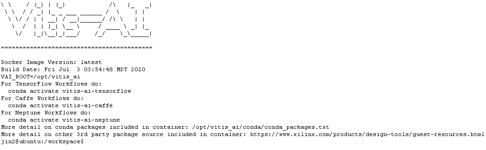
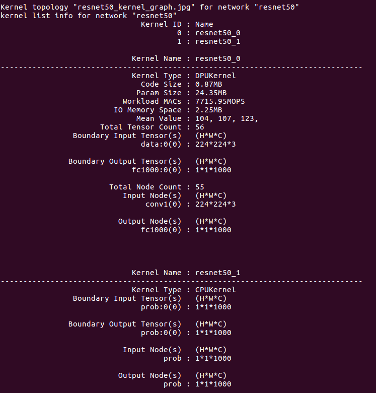
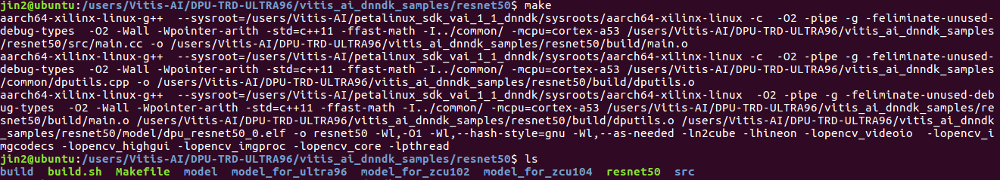

# Vitis-AI-1.1 Design Flow for Ultra96
## Reference
https://www.hackster.io/AlbertaBeef/vitis-ai-1-1-flow-for-avnet-vitis-platforms-part-1-007b0e

## Quick Start

1. Clone Xilinx’s Vitis-AI github repository: 
 

```
$ git clone https://github.com/Xilinx/Vitis-AI
$ cd Vitis-AI
$ export VITIS_AI_HOME="$PWD"

```
 
2. Download the pre-trained models from the Xilinx Model Zoo:
 
```
$ cd $VITIS_AI_HOME/AI-Model-Zoo
$ source ./get_model.sh 
```
 
3. Download the DPU-TRD directory for your platform:
 
```
$ git clone https://github.com/JinChen-tw/Vitis-AI-1.1-Flow-for-Ultra96
$ mv Vitis-AI-1.1-Design-Flow-for-Ultra96V2/DPU-TRD-ULTRA96/ .
$ export TRD_HOME=$VITIS_AI_HOME/DPU-TRD-ULTRA96
```

4. Launch the tools docker from the Vitis-AI directory 
```
$ cd $VITIS_AI_HOME
$ sh -x docker_run.sh xilinx/vitis-ai 
```

```
$ conda activate vitis-ai-caffe
(vitis-ai-caffe) $ cd DPU-TRD-ULTRA96
(vitis-ai-caffe) $ cd modelzoo

```  
5. Create a directory for the compiled models
```
(vitis-ai-caffe) $ mkdir compiled_output
```
 
6. Compile the caffe model for the resnet50 application, using the generic script that you downloaded:
```
(vitis-ai-caffe) $ source ./compile_cf_model.sh resnet50 cf_resnet50_imagenet_224_224_7.7G
```



Compile the tensorflow models, using the generic script:
 
```
$ conda activate vitis-ai-tensorflow
(vitis-ai-tensorflow) $ source ./compile_tf_model.sh tf_resnet50 tf_resnetv1_50_imagenet_224_224_6.97G
```


7. Exit the tools docker
```
(vitis-ai-caffe) $ exit
```

### Compile the DNNDK based AI Applications

1. Change to the DPU-TRD-ULTRA96 work directory.
```
$ cd DPU-TRD-ULTRA96 
```


2. Download and install the SDK for cross-compilation, specifying a unique and meaningful installation destination (knowing that this SDK will be specific to the Vitis-AI 1.1 DNNDK samples)

```
$ wget -O sdk.sh https://www.xilinx.com/bin/public/openDownload?filename=sdk.sh
$ chmod +x sdk.sh
$ ./sdk.sh -d $VITIS_AI_HOME
```
3. Setup the environment for cross-compilation

```
$ unset LD_LIBRARY_PATH
$ source $VITIS_AI_HOME/petalinux_sdk_vai_1_1_dnndk/environment-setup-aarch64-xilinx-linux
```
4. Download and extract the additional DNNDK runtime content to the previously installed SDK
```
$ wget -O vitis-ai_v1.1_dnndk.tar.gz  https://www.xilinx.com/bin/public/openDownload?filename=vitis-ai_v1.1_dnndk.tar.gz
$ tar -xvzf vitis-ai-v1.1_dnndk.tar.gz
```
5. Install the additional DNNDK runtime content to the previously installed SDK

```
$ cd vitis-ai-v1.1_dnndk
$ ./install.sh $VITIS_AI_HOME/petalinux_sdk_vai_1_1_dnndk/sysroots/aarch64-xilinx-linux
```

6. Make a working copy of the “vitis_ai_dnndk_samples” directory.
```
$ cd DPU-TRD-ULTRA96 
$ cp -r ../mpsoc/vitis_ai_dnndk_samples .
```
7. Download and extract the additional content (images and video files) for the DNNDK samples.
```
$ wget -O vitis-ai_v1.1_dnndk_sample_img.tar.gz https://www.xilinx.com/bin/public/openDownload?filename=vitis-ai_v1.1_dnndk_sample_img.tar.gz
$ tar -xvzf vitis-ai_v1.1_dnndk_sample_img.tar.gz
```

#### RESNET50

1. For the resnet50 application, create a model directory and copy the dpu_*.elf model files we previously built
```
$ cd $TRD_HOME/vitis_ai_dnndk_samples/resnet50
$ mkdir model_for_ultra96
$ cp ../../modelzoo/compiled_output/cf_resnet50_imagenet_224_224_7.7G/dpu_*.elf model_for_ultra96/.
```
2. For the resnet50 application, copy the “model_for_ultra96” directory to “model”, then run the “make” command
```
$ cp -r model_for_ultra96 model
$ make
```


#### Execute the AI applications on hardware
1. Boot the target board with the sdcard. And setting the board IP address.
```
$ ifconfig eth0 192.168.0.10
```

2. Download the execute file from host to the target using scp with the following command 
#### (On host machine)
```
$ scp resnet50 root@192.168.0.10:~/vitis_ai_dnndk_samples/resnet50/
```

3. Define the DISPLAY environment variable
```
$ export DISPLAY=:0.0
```
4. Change the resolution of the DP monitor to 640x480
```
$ xrandr --output DP-1 --mode 640x480
```
5. Launch the DNNDK API based sample applications
```
$ cd vitis_ai_dnndk_samples
```
6. Launch the caffe version of the resnet50 application
```
$ cd resnet50
$ ./resnet50
```

 
 


