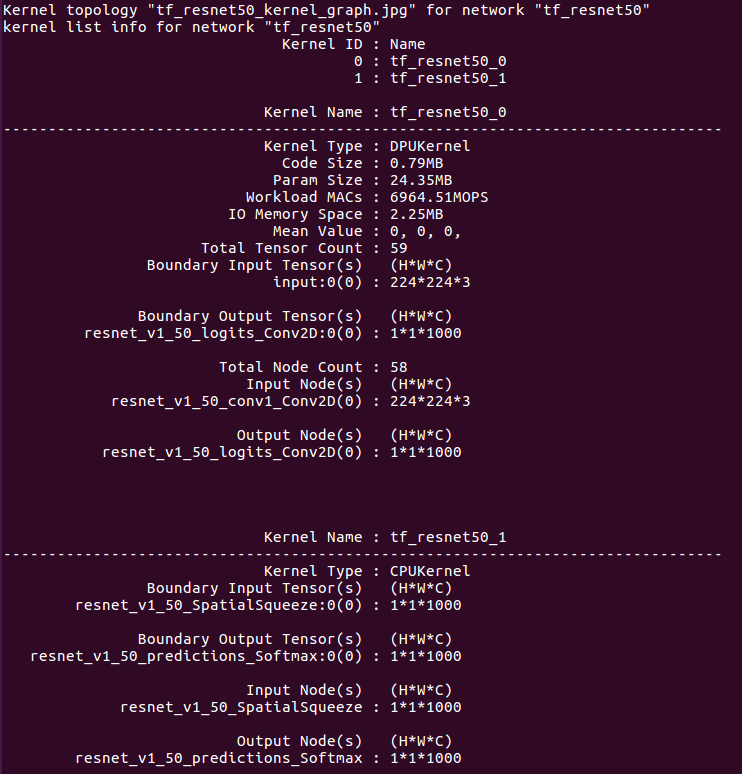

# Vitis-AI-1.1 Design Flow for Ultra96
## Quick Start

1. Clone Xilinx’s Vitis-AI github repository: 
 

```
$ git clone https://github.com/Xilinx/Vitis-AI
$ cd Vitis-AI
$ export VITIS_AI_HOME="$PWD"

```
 
2. Download the pre-trained models from the Xilinx Model Zoo:
 
```
$ cd $VITIS_AI_HOME/AI-Model-Zoo
$ source ./get_model.sh 
```
 
3.Download the DPU-TRD directory for your platform:
 
```
$ git clone https://github.com/JinChen-tw/Vitis-AI-1.1-Flow-for-Ultra96
$ mv Vitis-AI-1.1-Design-Flow-for-Ultra96V2/DPU-TRD-ULTRA96/ .
$ export TRD_HOME=$VITIS_AI_HOME/DPU-TRD-ULTRA96
```

4. Launch the tools docker from the Vitis-AI directory 
```
$ cd $VITIS_AI_HOME
$ sh -x docker_run.sh xilinx/vitis-ai 
```

```
$ conda activate vitis-ai-caffe
(vitis-ai-caffe) $ cd DPU-TRD-ULTRA96
(vitis-ai-caffe) $ cd modelzoo

```  
Create a directory for the compiled models
```
(vitis-ai-caffe) $ mkdir compiled_output
```
 
Compile the caffe model for the resnet50 application, using the generic script that you downloaded:
```
(vitis-ai-caffe) $ source ./compile_cf_model.sh resnet50 cf_resnet50_imagenet_224_224_7.7G
```


Compile the tensorflow models, using the generic script:
 
```
$ conda activate vitis-ai-tensorflow
(vitis-ai-tensorflow) $ source ./compile_tf_model.sh tf_resnet50 tf_resnetv1_50_imagenet_224_224_6.97G
```



Exit the tools docker
```
(vitis-ai-caffe) $ exit
```
 
 


